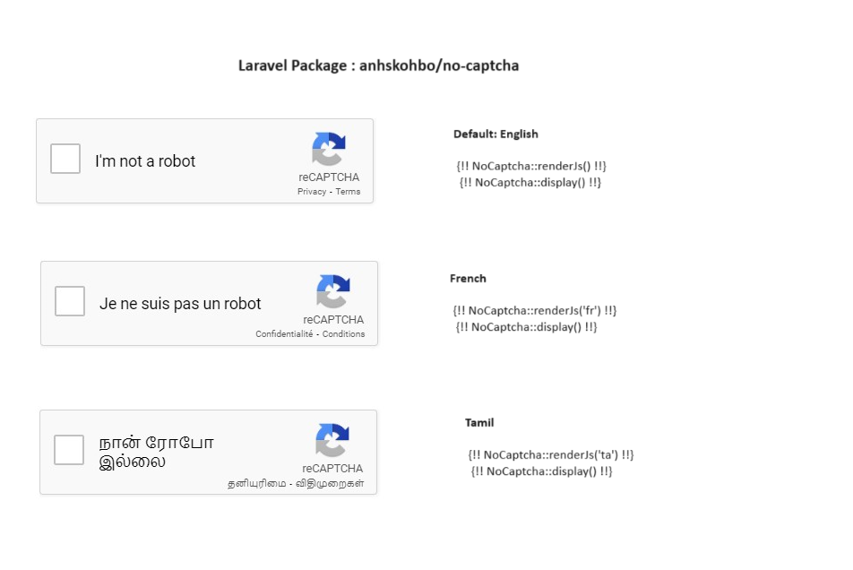

## Add Google Recaptcha to Laravel 10 Application

Step 1: Get reCAPTCHA API Key

```
1.1 Go to the reCAPTCHA website (https://www.google.com/recaptcha/about/) and click on the "Admin Console" button.
1.2 Create a new site by following the instructions on the website.
1.3 Obtain your site key and secret key.
```

Step 2: Install the Google reCAPTCHA Package

In your Laravel project, you can use the "anhskohbo/no-captcha" package to integrate reCAPTCHA. Install it using Composer:

```bash
composer require anhskohbo/no-captcha
```

Step 3: Configure Your reCAPTCHA Keys

Add your reCAPTCHA keys to the Laravel configuration. Open the config/app.php file and add the following to the providers array:

```php

'providers' => ServiceProvider::defaultProviders()->merge([
  Anhskohbo\NoCaptcha\NoCaptchaServiceProvider::class,
])->toArray(),

```
And add the following to the aliases array:

```php
'aliases' => Facade::defaultAliases()->merge([
'NoCaptcha' => Anhskohbo\NoCaptcha\Facades\NoCaptcha::class,
])->toArray(),

```
Step 4: Now, publish the configuration file:

```php
php artisan vendor:publish --provider="Anhskohbo\NoCaptcha\NoCaptchaServiceProvider"
```

Step 5: Configuration

Add NOCAPTCHA_SECRET and NOCAPTCHA_SITEKEY in .env file :

```php
NOCAPTCHA_SECRET=secret-key
NOCAPTCHA_SITEKEY=site-key
```

Step 6: Use reCAPTCHA in Your Forms

Add the reCAPTCHA widget to your forms. Open your form file (e.g., resources/views/welcome.blade.php) and add the following:

Default Option:
```html
{!! NoCaptcha::renderJs() !!}
{!! NoCaptcha::display() !!}
```

Different Language Support or onloadcallback option:

Language Support: https://developers.google.com/recaptcha/docs/language

Onload Call Back: https://developers.google.com/recaptcha/docs/display#explicit_render

French Language:

```html
{!! NoCaptcha::renderJs('fr', true, 'recaptchaCallback') !!}
{!! NoCaptcha::display() !!}
```
## Screenshots



Step 7: Validate reCAPTCHA in Your Controller

In your controller, validate the reCAPTCHA response. Open your controller file (e.g., app/Http/Controllers/RegisterController.php) and add the validation in your method:

```php
    Validator::make($request->all(), [
        'g-recaptcha-response' => 'required|captcha',
    ]);
```
Step 8: Display Errors in Your Form

If there are validation errors, display them in your form. Open your form file (welcome.blade.php) again and add the following:

```php
    @error('g-recaptcha-response')
    <div class="text text-danger">{{ $message }}</div>
    @enderror
```

Note: 

This will only work if you access localhost using 127.0.0.1/... rather than localhost/....

https://developers.google.com/recaptcha/docs/faq#localhost_support

## Reference

https://packagist.org/packages/anhskohbo/no-captcha

## Support

For support, email bmahendranmca@gmail.com